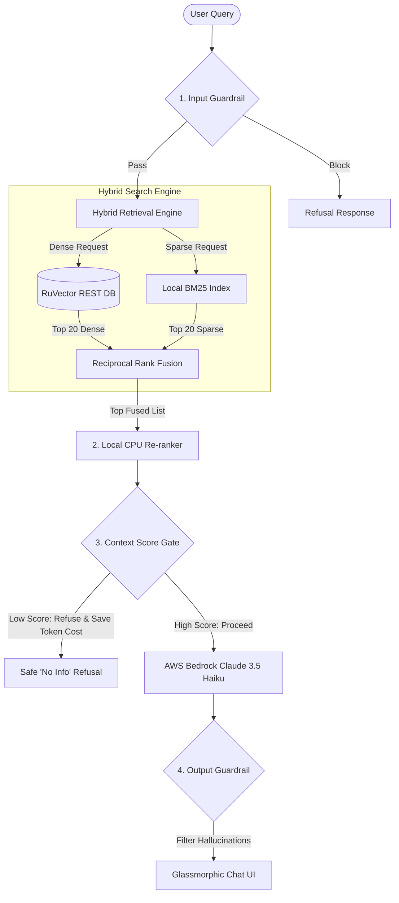

# Upgraded Walkthrough: Smart Hybrid RAG with Guardrails

We have upgraded your RAG Chatbot system to include **state-of-the-art hybrid search (Dense + Sparse)** and a **three-tier financial guardrail layer**, with **AWS Bedrock Claude 3.5 Haiku** configured as the default LLM. The system is designed to find exact numbers from financial sheets instantly while keeping compute and API invocation costs at an absolute minimum.

---

## Technical Architecture (Upgraded)



---

## Smarter, Safer, and Cheaper Features

### 1. Hybrid Sparse-Dense Retrieval (RRF Blended)
*   **Dense (Semantic)**: Similarity search query sent to **RuVector HNSW REST server** finds conceptual matches (e.g., "receivables exposures" matches "unpaid customer invoices").
*   **Sparse (Keyword)**: Custom, memory-cached **`SimpleBM25`** sparse index runs in-container to match exact codes, figures, or item sections (e.g., "Item 7A" or "432.1M").
*   **Reciprocal Rank Fusion (RRF)**: Merges both lists to yield a single, unified top rank of documents, capturing both exact keyword hits and global conceptual meanings.

### 2. Three-Tier Corporate Guardrails
*   **Input Guardrail**: Restricts prompts strictly to the **financial and corporate domain**. Automatically blocks and flags malicious prompt injections or system overrides.
*   **Context Score Gate**: Automatically scores retrieved documents. If they are irrelevant (score below threshold), the system halts and refuses to answer **before calling the Bedrock API**. This **saves 100% of LLM token costs** on bad queries and completely prevents hallucinations!
*   **Output Guardrail & Disclaimers**: Automatically verifies that any large number/metric claimed in the response exists inside the source document extracts, adds warning citations for unverified figures, and appends a professional financial disclaimer.

### 3. AWS Bedrock Claude 3.5 Haiku Default
*   Uses **`anthropic.claude-3-5-haiku-20241022-v1:0`** (the gold standard for cost-effective corporate text extraction). It is extremely smart at reading financial markdown tables and has exceptionally low latencies.

---

## How to Deploy & Run (Upgraded)

### Local Environment (Docker Compose)
1.  **Configure environment** in your terminal:
    *   **Windows PowerShell**:
        ```powershell
        $env:EMBEDDING_PROVIDER="local"
        $env:LLM_PROVIDER="bedrock"
        $env:AWS_ACCESS_KEY_ID="your-aws-key"
        $env:AWS_SECRET_ACCESS_KEY="your-aws-secret"
        $env:AWS_REGION="us-east-1"
        ```
2.  **Start application**:
    ```bash
    docker-compose up --build -d
    ```
3.  **Open URL**: Navigate to **[http://localhost:8000](http://localhost:8000)**. Upload a PDF/Excel report, and start chatting!

---

## AWS Production Deployment ($3.80/month or Free Tier)

Deploy the entire stack securely onto a single arm64 EC2 virtual machine.

```bash
# Navigate to aws directory
cd d:/Ruvector_Rag/aws

# Init & apply Terraform
terraform init
terraform apply \
  -var="llm_provider=bedrock" \
  -var="embedding_provider=local"
```

*   **Secure SSM Console Access**: Access your instance securely (no open SSH port 22 needed):
    ```bash
    aws ssm start-session --target <instance-id>
    ```
*   **DB File Persistence**: Your database files are persistent on an attached AWS EBS gp3 SSD volume mounted directly to your Docker container. Resizing or terminating your EC2 instance will keep your data safely intact.
